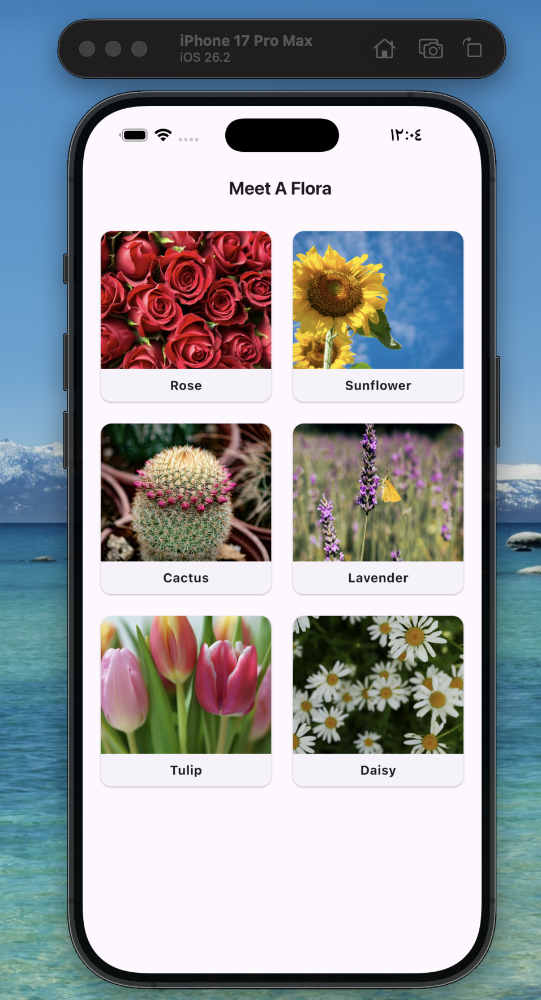
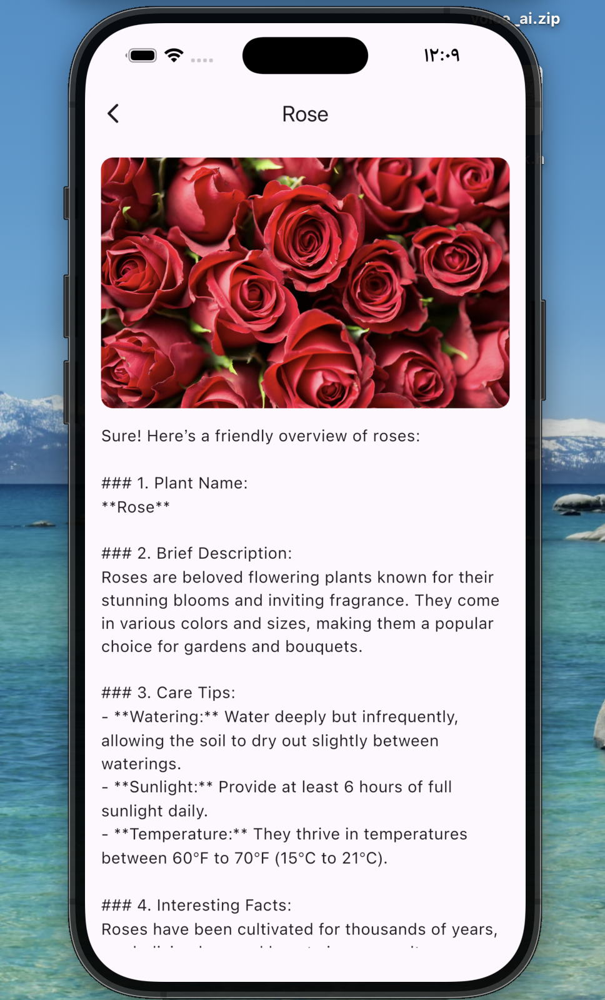
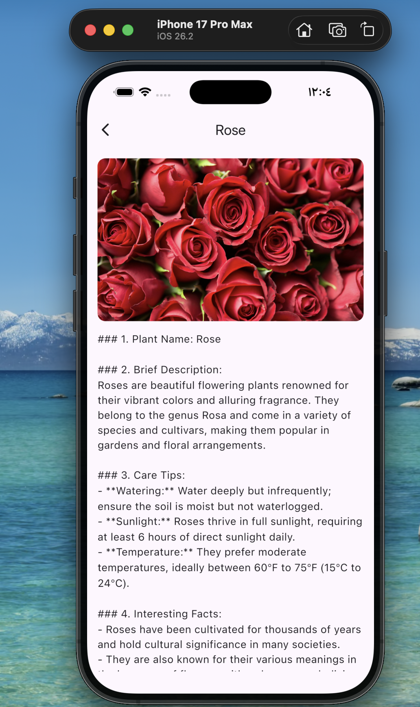

# 🌿 Meet A Flora

> A smart Flutter app that identifies plants and provides AI-generated botanical information.

---

## 📱 App Screenshots

### Page 1 - Discovery Screen


### Page 2 - Dynamic Plant Details (AI Generated)
> 🤖 Notice how the AI generates **different information** every time!

#### First Visit - Rose


#### Second Visit - Rose


> ✨ Same plant, different AI-generated content — proving the "Fresh Data" requirement!

---

## ✨ Features

- 🌱 Browse a collection of beautiful plants
- 🤖 AI-powered plant analysis using OpenAI GPT-4
- 📖 Dynamic botanical information generated fresh every visit
- 🎨 Clean and modern UI

---

## 🏗️ Architecture

This app is built with **Clean Architecture** principles:
lib/
├── core/
│   ├── di/
│   ├── errors/
│   ├── navigation/
│   └── network/
└── features/
├── discovery/
└── plant_details/

---

## 🛠️ Tech Stack

| Technology | Purpose |
|-----------|---------|
| Flutter | UI Framework |
| BLoC | State Management |
| GetIt + Injectable | Dependency Injection |
| GoRouter | Navigation |
| Dio | HTTP Client |
| OpenAI API | AI Plant Analysis |
| Clean Architecture | Code Structure |
| Either Pattern | Error Handling |
| Freezed | Immutable Models |

---

## 🚀 Getting Started

1. Clone the repo
2. Add your API key in `.env`:
OPENAI_API_KEY=your_openai_api_key
3. Run:
```bash
flutter pub get
dart run build_runner build
flutter run
```

---

## 👩‍💻 Developer

**Nora** — Flutter Developer 